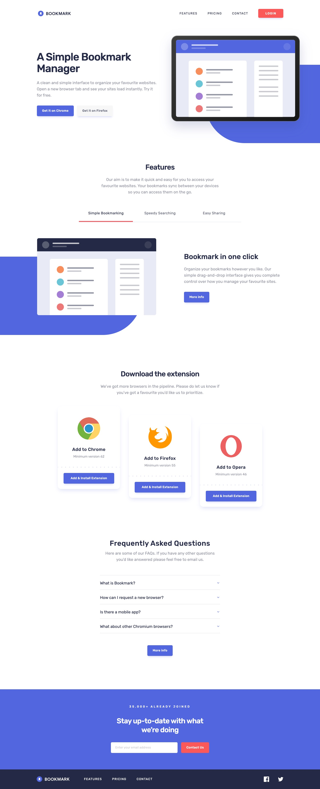

# Frontend Mentor - Bookmark landing page solution

This is a solution to the [Bookmark landing page challenge on Frontend Mentor](https://www.frontendmentor.io/challenges/bookmark-landing-page-5d0b588a9edda32581d29158). Frontend Mentor challenges help you improve your coding skills by building realistic projects.

## Table of contents

- [Overview](#overview)
  - [The challenge](#the-challenge)
  - [Beyond the brief](#beyond-the-brief)
  - [Screenshot](#screenshot)
  - [Links](#links)
- [Built with](#built-with)
- [Getting started](#getting-started)
- [Project structure](#project-structure)
- [Implementation notes](#implementation-notes)
- [Author](#author)

## Overview

### The challenge

Users should be able to:

- View the optimal layout for the site depending on their device's screen size
- See hover states for all interactive elements on the page
- Receive an error message when the newsletter form is submitted if:
  - The input field is empty
  - The email address is not formatted correctly

### Beyond the brief

- Visible focus styles on every interactive element
- Accessible mobile menu: focus trap, Escape to close, focus returned to the toggle, automatic close when the desktop layout kicks in
- Keyboard-accessible feature tabs and FAQ accordion
- Sticky header that never hides the focused element
- Newsletter feedback announced to screen readers, without reloading the page
- Smooth scroll to the top for placeholder links, disabled when reduced motion is requested

### Screenshot



### Links

- Repository: [github.com/FerdinandoGeografo/bookmark-landing-page](https://github.com/FerdinandoGeografo/bookmark-landing-page)

## Built with

- Semantic HTML and a mobile-first layout with Flexbox
- [React 19](https://react.dev/) with [TypeScript](https://www.typescriptlang.org/) in strict mode
- [Vite](https://vite.dev/) with the [React Compiler](https://react.dev/learn/react-compiler)
- [Tailwind CSS 4](https://tailwindcss.com/) with design tokens in `src/index.css`
- [Base UI](https://base-ui.com/) primitives (tabs, accordion, dialog, button, input), wrapped in `src/ui` following the [shadcn/ui](https://ui.shadcn.com/) `base-nova` conventions
- [class-variance-authority](https://cva.style/), `clsx` and `tailwind-merge` for component variants
- An inline SVG sprite for the design icons, plus one [Lucide](https://lucide.dev/) chevron
- ESLint and Prettier (with the Tailwind CSS plugin)

## Getting started

Requires Node.js and npm (developed with Node.js 24).

```bash
npm ci           # install the locked dependencies
npm run dev      # start the dev server
npm run lint     # run ESLint
npm run build    # type-check and build into dist/
npm run preview  # serve the production build
```

## Project structure

```text
src/
  components/  landing page sections and shared pieces (Header, MobileMenu, Icon, ...)
  ui/          Base UI wrappers: button, tabs, accordion, input
  constants/   static content: features, browsers, questions, links, socials
  types/       shared data types
  lib/         utilities (cn)
public/        images, favicon and the Rubik woff2 fonts
```

## Implementation notes

- **Breakpoints.** The design provides 375px and 1440px frames. Typography switches at `md` (768px). The layout switches to rows at `lg` (1024px), because the three 280px browser cards and their 40px gaps alone need 920px. Between 768px and 1023px the page uses the stacked layout with larger type.
- **Fluid desktop.** Between 1024px and 1440px the hero gutters and the illustrations scale proportionally and stop at their 1440px values.
- **Browser card offsets.** The 0/40/80px offsets live on the list items, so the cards' own content stays free for entrance animations.
- **Fonts.** Rubik 400 and 500 are served as latin-subset woff2 files (about 20 KB each) and preloaded.
- **Newsletter.** Validation runs in the browser only; there is no backend.
- **Links.** Navigation and footer links are placeholders (`#`) that scroll back to the top.

## Author

- GitHub - [@FerdinandoGeografo](https://github.com/FerdinandoGeografo)
