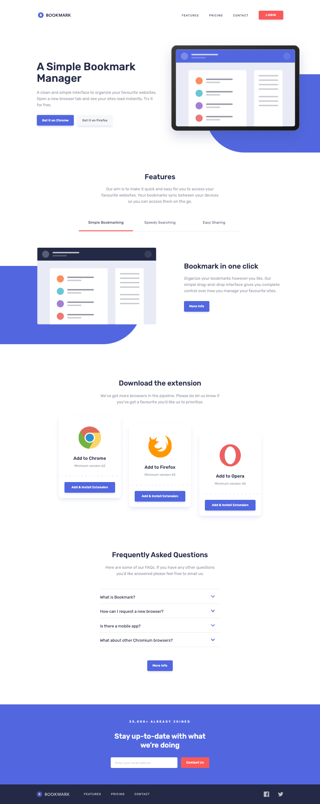
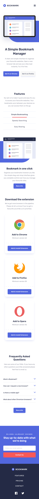
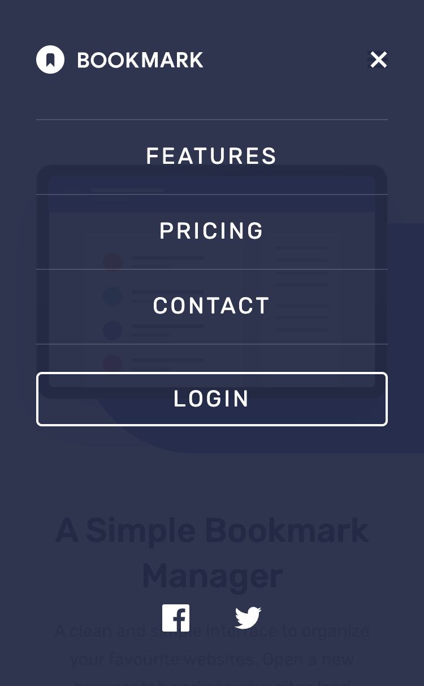
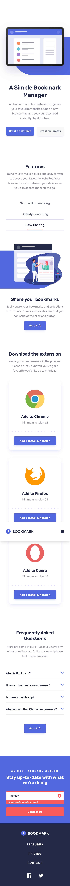

# Frontend Mentor - Bookmark landing page solution

This is a solution to the [Bookmark landing page challenge on Frontend Mentor](https://www.frontendmentor.io/challenges/bookmark-landing-page-5d0b588a9edda32581d29158). Frontend Mentor challenges help you improve your coding skills by building realistic projects.

## Table of contents

- [Overview](#overview)
  - [The challenge](#the-challenge)
  - [Page behaviour](#page-behaviour)
  - [Screenshot](#screenshot)
  - [Links](#links)
- [My process](#my-process)
  - [Built with](#built-with)
  - [What I learned](#what-i-learned)
  - [Useful resources](#useful-resources)
  - [AI Collaboration](#ai-collaboration)
- [Author](#author)

## Overview

### The challenge

Users should be able to:

- View the optimal layout for the site depending on their device's screen size
- See hover states for all interactive elements on the page
- Receive an error message when the newsletter form is submitted if:
  - The input field is empty
  - The email address is not formatted correctly
- See focus states for all interactive elements and use the whole page with the keyboard

### Page behaviour

- The header stays pinned to the top and gains a soft shadow once the page scrolls; keyboard focus and section links scroll content into view below it.
- Below 1024px the navigation moves into a full-screen menu that fades in with its rows one after another. It keeps focus inside, closes with Escape, returns focus to its button and closes by itself when the desktop layout kicks in.
- Features and Contact, in the navigation and in the footer, scroll smoothly to their sections. From the mobile menu the page scrolls once the menu has closed, and Tab continues from the section.
- Arrow keys move between the feature tabs, Enter or Space opens one, and Tab goes on to the button of the open panel. In a row the indicator slides to the new tab and the content moves in its direction; stacked, the indicator grows under the tab and the content fades and rises. Switching tabs never changes the height of the section.
- The FAQ keeps one answer open at a time; answers slide open and closed, and the arrow turns.
- The newsletter validates on submit only: an empty or invalid email shows an error that screen readers announce and moves focus back to the field, and editing the field clears it. There is no backend, so a valid email opens a notice that repeats the address and explains that nothing was saved.
- The header and the hero animate in on load. The other sections reveal once as they scroll into view, and the browser cards drop into their offsets one after another on wide screens. Keyboard focus inside a section shows it at once.
- With reduced motion requested, elements appear in their final place without animating and section links jump instead of scrolling. The page follows the setting even when it changes while the page is open.
- Pricing, Login, "Get it on…", "More Info" and "Add & Install Extension" open a notice explaining that the page is a demo. The social links are placeholders that lead back to the top.

### Screenshot






### Links

- Solution URL: [GitHub Repository](https://github.com/FerdinandoGeografo/bookmark-landing-page)
- Live Site URL: [Bookmark](https://bookmark-landing-page-fg.vercel.app/)

## My process

### Built with

- Semantic HTML5 markup
- CSS custom properties and `clamp()`
- Flexbox and CSS Grid
- Mobile-first workflow
- [React (v19)](https://react.dev/) - JS library, with the [React Compiler](https://react.dev/learn/react-compiler)
- [TypeScript](https://www.typescriptlang.org/) - JS superset, in strict mode
- [Vite](https://vite.dev/) - Frontend build tool
- [Tailwind CSS (v4)](https://tailwindcss.com/) - For styles, with the design tokens in `src/index.css`
- [Base UI](https://base-ui.com/) - Unstyled, accessible components (tabs, accordion, dialog)
- [shadcn/ui](https://ui.shadcn.com/) - Component primitives in the `base-nova` style, with [class-variance-authority](https://cva.style/) for variants
- [Motion](https://motion.dev/) - Entrance, reveal and component animations

### What I learned

`src/components` holds the page sections and the pieces they share, while `src/ui` keeps the shadcn/ui primitives, restyled with the design's palette.
Content lives in `src/constants` and its types in `src/types`, so components only map data. The layout has one real breakpoint, `lg` (1024px).

#### A decoration that scales with its image

Each illustration sits on a blue pill that leaves the viewport. Instead of a set of breakpoint classes, `ImageDecoration` interpolates every measurement between frames, using the image box width as the variable, and clamps it to the max and min values:

```ts
function fluid(
  mobile,
  desktop,
  { image: from },
  { image: to },
  heightRatio = 1,
) {
  const slope = (desktop - mobile) / (to - from);
  const intercept = mobile - slope * from;
  return `clamp(${mobile}px, ${round(intercept)}px + ${round(slope * 100 * heightRatio)}%, ${desktop}px)`;
}
```

The results become custom properties on the box (`--pill-width`, `--pill-top`...), and an `::after` pseudo-element reads them.

#### Tabs that never move the page

The three feature illustrations have different sizes. Every tab keeps the box of the first one, and all panels stay mounted in one grid cell, so neither the images nor the descriptions can change the height:

```tsx
<div className="grid *:col-start-1 *:row-start-1">
  {FEATURES.map((feature) => (
    <TabsContent
      key={feature.id}
      value={feature.id}
      keepMounted
      hidden={false}
      className="transition-[visibility] data-hidden:invisible data-hidden:delay-250"
    >
      {/* ... */}
    </TabsContent>
  ))}
</div>
```

Base UI makes the previous panel `inert` as soon as the tab changes, so it leaves the tab order at once, while CSS hides it only after its content has animated out.

#### Reveals that never hide content

A section becomes a reveal group by spreading `useReveal()` on a `motion` element, or through the `Reveal` component built on it. Its children follow with presets such as `fadeUp()`. A few details made it reliable:

```ts
function reveal() {
  if (isRevealedRef.current) return;
  isRevealedRef.current = true;
  controls.start("visible");
}

function showAtOnce() {
  isRevealedRef.current = true;
  controls.start("visible", { duration: 0 });
}
```

- The reveal starts when an element passes a 48px band at the bottom of the viewport (`amount: "some"` with a negative bottom margin). A share of the element would not do: at 400% zoom, 20% of a tall section is taller than the screen, and the section stayed invisible.
- Motion calls `onViewportEnter` again every time a `once` element comes back into view, so the ref keeps the reveal from replaying.
- `showAtOnce` runs on `onFocusCapture`. The transition passed to `start` replaces the one of the variants, delays and stagger included, and reaches every child, so a control reached with Tab is visible at once.

#### Placement and entrance on separate elements

On wide screens the browser cards sit 0, 40 and 80px lower than each other, and they also drop into place. The offset belongs to the list item and the entrance to the card inside it, so the final layout does not depend on the animation and stays the same with reduced motion:

```tsx
<li style={cardOffset(index)} className="lg:translate-y-(--card-offset)">
  <Reveal variants={cardEntrance(isDesktop, index)}>
    <BrowserItem browser={browser} />
  </Reveal>
</li>
```

The list renders the same elements on both sides of the breakpoint and only the entrance changes, so resizing or zooming keeps a focused card focused and a revealed card visible.

#### Small details

- One demo dialog serves every notice: triggers pass a payload through a Base UI handle, and the newsletter opens it with `demoDialog.openWithPayload({ kind: "newsletter", email })`.
- Motion's `useReducedMotion` reads the preference once, so a small `usePrefersReducedMotion` hook built on `useSyncExternalStore` and `matchMedia` follows it instead.
- The header shadow reads the scroll position through `useSyncExternalStore`: scrolling down the whole page re-renders the header once, when it leaves the top.
- The hero illustration declares its size, so the text beside it does not move when it loads.
- The scrollbar is thin and takes the primary blue through `scrollbar-color` and `scrollbar-width`, which the mobile menu inherits.

### Useful resources

- [Base UI Dialog](https://base-ui.com/react/components/dialog) - Detached triggers and payloads through `Dialog.createHandle()`.
- [Base UI Tabs](https://base-ui.com/react/components/tabs) - `keepMounted` panels and keyboard activation.
- [shadcn/ui for Base UI](https://ui.shadcn.com/docs/components) - The primitives behind `src/ui`.
- [Tailwind CSS v4](https://tailwindcss.com/docs/theme) - Theme variables and custom properties in arbitrary values.
- [Tailwind CSS functional utilities](https://tailwindcss.com/docs/adding-custom-styles#functional-utilities) - The `--value()` syntax behind the fluid utilities.
- [CSS clamp()](https://developer.mozilla.org/en-US/docs/Web/CSS/clamp) - The fluid measurements of the decorations.
- [useSyncExternalStore](https://react.dev/reference/react/useSyncExternalStore) - Subscribing to the scroll position and the media queries.
- [Motion for React](https://motion.dev/docs/react) - Variants, viewport triggers, `AnimatePresence` and layout animations.
- [Motion and Base UI](https://motion.dev/docs/base-ui) - Animating Base UI parts through their `render` prop, exits included.
- [ARIA Authoring Practices: Tabs](https://www.w3.org/WAI/ARIA/apg/patterns/tabs/) and [Accordion](https://www.w3.org/WAI/ARIA/apg/patterns/accordion/) - The keyboard patterns of the features and the FAQ.

### AI Collaboration

I used Claude, through Claude Code, as a pair programmer for the review, the responsive layout and the accessibility polish, while keeping the decisions and the testing on my side.

- **Planning first**: the work started from a review of the existing code and a plan split into phases (interactions and accessibility, responsive layout, refactoring, assets, animations), each closed with small commits I tested locally.
- **Reviews**: audits of keyboard navigation, focus states, the mobile menu, reduced motion and the newsletter feedback, plus hunts for unused styles and dependencies. A final review after the first deploy checked the hooks and the Motion integration against the installed library sources.
- **Context in local files**: an `AGENTS.md` with the working rules for any coding agent, and notes on the stack, the design measurements and the motion requirements.

## Author

- Frontend Mentor - [@FerdinandoGeografo](https://www.frontendmentor.io/profile/FerdinandoGeografo)
- LinkedIn - [@FerdinandoGeografo](https://www.linkedin.com/in/ferdinandogeografo/)
- GitHub - [@FerdinandoGeografo](https://github.com/FerdinandoGeografo/)
